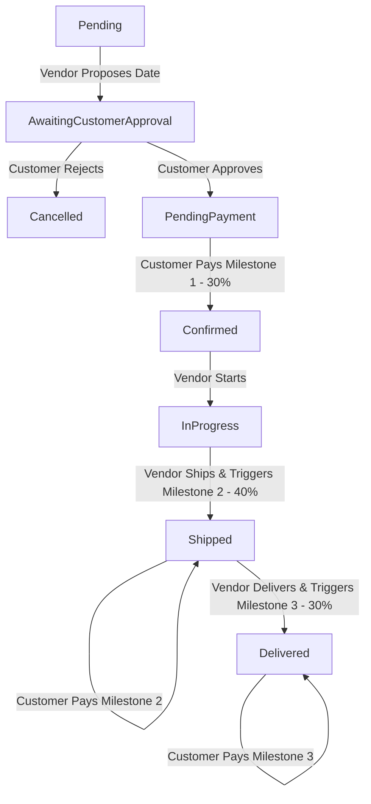

# Frontend Integration Guide: Deferred Payment & Status Flow

This document details the API contracts, order status flows, and validation rules updated on the backend for the **Deferred Payment System**.

---

## 1. Vendor Order Statuses & Lifecycle Flow

The `VendorOrderStatus` enum strictly contains the following **8 statuses**:
1. `Pending` (Initial status when an order is created)
2. `AwaitingCustomerApproval` (Vendor proposed a delivery date, waiting for customer response)
3. `PendingPayment` (Customer approved the schedule, waiting to pay the first milestone)
4. `Confirmed` (First milestone is paid, vendor can start working)
5. `InProgress` (Vendor is working on the order)
6. `Shipped` (Vendor shipped the items, waiting for second milestone payment)
7. `Delivered` (Items delivered, waiting for final milestone payment. **This is the final status**)
8. `Cancelled` (Order cancelled)

### Lifecycle Flow Diagram


> [!NOTE]
> * **No `Completed` status exists**. The final status for `VendorOrder` remains `Delivered`.
> * The parent `MasterOrder` status derives to `Completed` automatically once all of its child `VendorOrders` are either `Delivered` or `Cancelled`.

---

## 2. Validation Rule: Proposing a Delivery Date

When a vendor proposes an estimated delivery date:
* **Rule:** The date must be **today or in the future** (checked on a daily basis: `dateTime.Date >= DateTime.UtcNow.Date`).
* **API Route:** `POST /api/vendor/orders/{orderId}/propose-date`
* **Response Error Example (if invalid date selected):**
  ```json
  {
    "status": 400,
    "errors": {
      "EstimatedDeliveryDate": [
        "Estimated delivery date must be today or in the future. / يجب أن يكون تاريخ التوصيل المتوقع من اليوم فصاعداً."
      ]
    }
  }
  ```

---

## 3. Payment Milestone Breakdown APIs

> [!IMPORTANT]
> **Remaining Balance Calculation Logic:**
> The remaining balance returned by the backend is calculated as:
> `RemainingBalance = TotalPrice - PaidMilestonesTotal`
> This ensures that vendor orders that are still in `Pending` or `AwaitingCustomerApproval` stages (which have 0 paid milestones) correctly have their full value counted towards the outstanding remaining balance, rather than only summing currently active milestones.

### A. Get Milestone Breakdown for Master Order (Customer)
Retrieve all milestones and remaining balance across all vendor orders under a Master Order.

* **Method:** `GET`
* **Route:** `/api/payments/masterorder/{masterOrderId}/remaining-balance`
* **Auth Required:** Customer (Owner of the order)
* **Response Body (`200 OK`):**
  ```json
  {
    "masterOrderId": 123,
    "totalPrice": 1500.00,
    "remainingBalance": 1200.00, // TotalPrice - Sum(PaidMilestones)
    "milestones": [
      {
        "milestoneId": 1,
        "vendorOrderId": 10,
        "vendorName": "Classic Carpentry",
        "milestoneStatus": "PendingPayment",
        "amount": 300.00,
        "isPaid": true,
        "paidAt": "2026-06-25T14:52:14Z"
      },
      {
        "milestoneId": 2,
        "vendorOrderId": 10,
        "vendorName": "Classic Carpentry",
        "milestoneStatus": "Shipped",
        "amount": 400.00,
        "isPaid": false,
        "paidAt": null
      }
    ]
  }
  ```

### B. Get Milestone Breakdown for Vendor Order (Customer & Vendor)
Retrieve outstanding payments and milestones for a specific Vendor Order.

* **Method:** `GET`
* **Route:** `/api/payments/vendororder/{vendorOrderId}/remaining-balance`
* **Auth Required:** Customer (Owner of the order) OR Vendor (Owner of the workshop)
* **Response Body (`200 OK`):**
  ```json
  {
    "vendorOrderId": 10,
    "workshopId": 2,
    "totalPrice": 500.00,
    "remainingBalance": 200.00, // TotalPrice - Sum(PaidMilestones)
    "milestones": [
      {
        "milestoneId": 1,
        "milestoneStatus": "PendingPayment",
        "amount": 300.00,
        "isPaid": true,
        "paidAt": "2026-06-25T14:52:14Z"
      },
      {
        "milestoneId": 2,
        "milestoneStatus": "Shipped",
        "amount": 400.00,
        "isPaid": false,
        "paidAt": null
      }
    ]
  }
  ```

---

## 4. Payment Initiation APIs

### A. Pay Current Milestone for Vendor Order
Initiate payment for the milestone matching the order's current status (e.g. pay 30% first payment if status is `PendingPayment`, pay 40% if status is `Shipped`, pay 30% if status is `Delivered`).

* **Method:** `POST`
* **Route:** `/api/payments/paymob/initiate-vendororder`
* **Auth Required:** Customer
* **Request Body:**
  ```json
  {
    "vendorOrderId": 10
  }
  ```
* **Response Body (`200 OK`):**
  ```json
  {
    "paymentUrl": "https://accept.paymob.com/api/acceptance/post_pay/..."
  }
  ```

### B. Pay Remaining Balance for Master Order

Initiate payment for the remaining unpaid balance across all eligible vendor orders under the Master Order in one single transaction. This flow allows paying the entire remaining balance or a custom partial amount.

* **Method:** `POST`
* **Route:** `/api/payments/paymob/initiate-masterorder`
* **Auth Required:** Customer
* **Request Body:**
  ```json
  {
    "masterOrderId": 123,
    "amount": 500.00 // Optional: custom partial amount to pay. If omitted, defaults to the entire remaining balance of eligible orders.
  }
  ```
* **Security & Business Rules:**
  * Only vendor orders that are **eligible** (i.e., currently in `Confirmed`, `InProgress`, `Shipped`, or `Delivered` status) will participate in the payment allocation.
  * Vendor orders in `Pending`, `AwaitingCustomerApproval`, or `PendingPayment` are excluded and will receive no payment allocation from this transaction.
  * If a custom `amount` is provided, it must be greater than zero and less than or equal to the total remaining unpaid balance of the eligible vendor orders.
  * The payment is distributed among the unpaid milestones of the eligible vendor orders (prioritizing `Shipped`, then `Delivered`, then `PendingPayment` milestones). Milestones can be split/partially paid if a custom partial amount is paid.
* **Response Body (`200 OK`):**
  ```json
  {
    "paymentUrl": "https://accept.paymob.com/api/acceptance/post_pay/..."
  }
  ```

---
 
## 5. In-App Notifications & Translation Keys

In-app notifications sent upon payment milestone actions carry localized translation keys split by `|`. 
Format: `[Status]|[Amount]|[VendorOrderId]`

* **Milestone Created (`MilestoneCreated`):**
  * E.g. `PendingPayment|150.00|10`
* **Milestone Paid (`MilestonePaid`):**
  * E.g. `PendingPayment|150.00|10`
